<div align="center">
  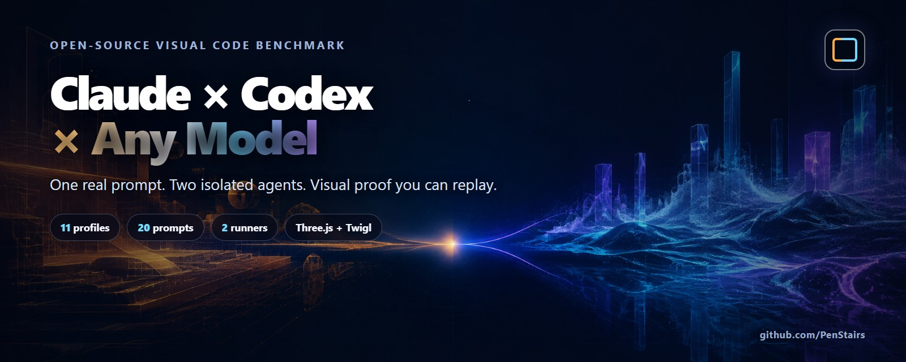
</div>

<div align="center">

[English](README.md) · [简体中文](README.zh-CN.md)

**The most complete, beautiful, and reproducible visual comparison kit for Claude, Codex, and models you bring yourself.**

One real prompt. Two isolated agents. Visual proof you can replay.

<a href="docs/benchmark-gallery.md"></a>
<a href="docs/quick-start.md"></a>

</div>

## Benchmark Highlights

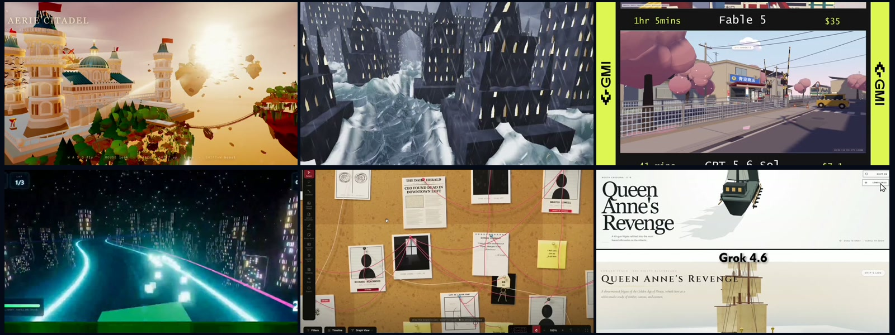

Six frames selected directly from the public source videos—not screenshots of the X interface. They represent [Procedural 3D World](https://x.com/slash1sol/status/2084590501685043400), [Drowned City](https://x.com/emollick/status/2064424775527624736), [Anime Suburban Street](https://x.com/gmi_cloud/status/2080834581247435102), [Cyberpunk Hovercar Racing](https://x.com/eyishazyer/status/2072677773655838950), [Crime Investigation Board](https://x.com/0x0SojalSec/status/2085440893994365214), and [Queen Anne's Revenge](https://x.com/TimJayas/status/2087474534924550433).

<sub>Source-media frames captured on 2026-09-03 for prompt discovery and attribution. They are not benchmark results produced by this repository. Media rights remain with the respective creators; inclusion does not imply ownership, endorsement, or independent reproduction.</sub>

### A real run from this project

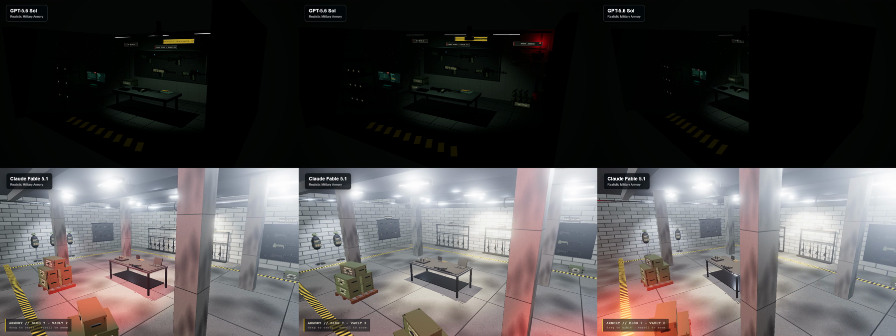

<p align="center"><sub>GPT-5.6 Sol (top) vs Claude Fable 5.1 (bottom), same Three.js prompt and matched capture policy. This real run demonstrates the output format; it is not a universal model ranking.</sub></p>

## Explore the Benchmark

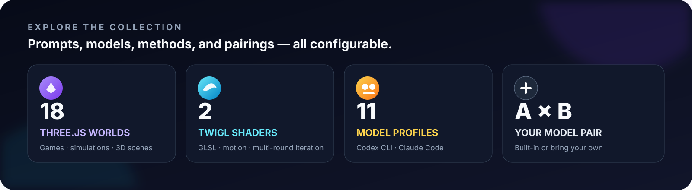

<table>
  <tr>
    <th width="33%">By method</th>
    <th width="34%">By model family</th>
    <th width="33%">By status</th>
  </tr>
  <tr>
    <td valign="top">
      <a href="docs/prompt-gallery.md#threejs-18"><strong>Three.js</strong></a> · 18 worlds<br />
      <a href="docs/prompt-gallery.md#twigl-2"><strong>Twigl</strong></a> · 2 shaders
    </td>
    <td valign="top">
      <a href="docs/model-gallery.md"><strong>Claude</strong></a> · <a href="docs/model-gallery.md"><strong>Codex</strong></a> · <a href="docs/model-gallery.md"><strong>DeepSeek</strong></a> · <a href="docs/model-gallery.md"><strong>GLM</strong></a> · <a href="docs/add-your-model.md"><strong>Custom</strong></a>
    </td>
    <td valign="top">
      <a href="benchmarks/official/README.md"><strong>Official</strong></a> · <a href="benchmarks/community/README.md"><strong>Community</strong></a> · <a href="https://github.com/PenStairs/claude-codex-visual-benchmark/releases/latest"><strong>Latest</strong></a>
    </td>
  </tr>
</table>

[Browse all prompts](docs/prompt-gallery.md) · [Browse all models](docs/model-gallery.md) · [Open the result gallery](docs/benchmark-gallery.md)

## Bring Any Two Models

Every user defines the comparison pair. Use two built-in profiles, add two private profiles, or mix them. A profile declares the model, provider endpoint, authentication class, runner, and reasoning level—so the same underlying model may intentionally have more than one execution profile.

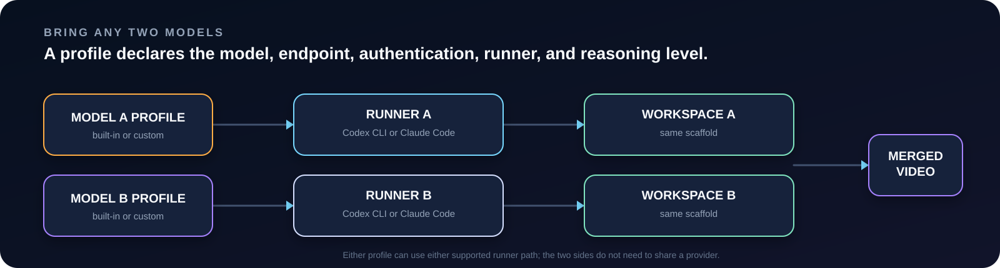

| Runner path | Built-in profiles | Compatible route |
|---|---:|---|
| **Codex CLI** | 6 | OpenAI login and Responses-compatible endpoints |
| **Claude Code** | 5 | Anthropic login and Anthropic-compatible endpoints |
| **Custom profile** | Unlimited | A tested configuration using either supported runner path |

[Add an OpenAI Responses-compatible model](examples/custom-models/openai-responses-compatible.json) · [Add an Anthropic-compatible model](examples/custom-models/anthropic-compatible.json) · [Read the custom-model guide](docs/add-your-model.md)

## How It Works


**Same prompt → two agents → isolated workspaces → verify → record → merge.**

Both agents receive the same normalized prompt bytes and equivalent clean scaffolds. The benchmark validates each result, captures matched browser motion, and exports one high-quality H.264 comparison video for X. Plan hash, timings, token usage, capture metadata, repairs, retries, and failures remain in the local run report.

The workflow is local-first. Generated code and evidence stay under gitignored `runs/`; credentials stay in native CLI login stores or environment variables. Only a final video is uploaded when the user explicitly chooses to publish it.

## Prompt Case Library

Every prompt has a visual frame from its source media, a direct X source, exact benchmark text, method classification, and a dedicated provenance page. Click a thumbnail for the full record.

<table>
  <tr>
    <td width="33%" valign="top"><a href="docs/prompts/anime-japanese-suburban-street-v1.md">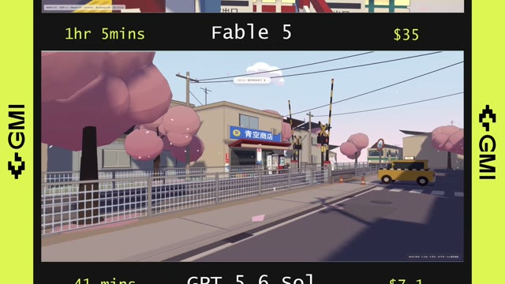</a><br /><strong>Anime Japanese Suburban Street</strong><br /><sub>Three.js · <a href="https://x.com/gmi_cloud/status/2080834581247435102">X source</a></sub></td>
    <td width="34%" valign="top"><a href="docs/prompts/city-eating-hole-game-v1.md">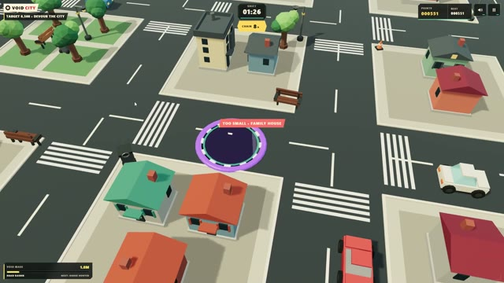</a><br /><strong>City-Eating Hole Game</strong><br /><sub>Three.js · <a href="https://x.com/givros/status/2078391824343880158">X source</a></sub></td>
    <td width="33%" valign="top"><a href="docs/prompts/cod-zombies-clone-v1.md">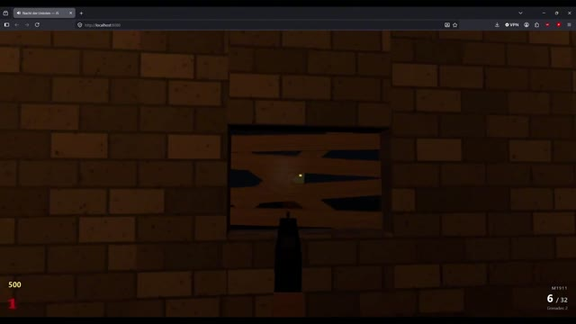</a><br /><strong>COD Zombies Clone</strong><br /><sub>Three.js · <a href="https://x.com/om_patel5/status/2064549188671508690">X source</a></sub></td>
  </tr>
  <tr>
    <td valign="top"><a href="docs/prompts/crime-investigation-board-v1.md">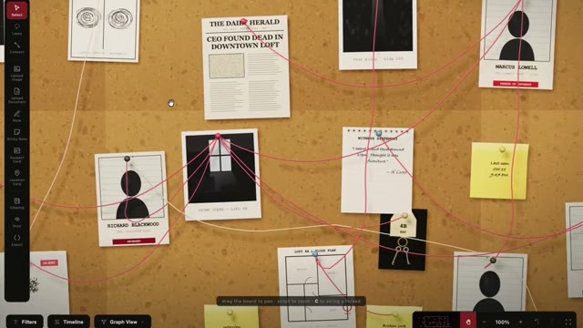</a><br /><strong>3D Crime Investigation Board</strong><br /><sub>Three.js · <a href="https://x.com/0x0SojalSec/status/2085440893994365214">X source</a></sub></td>
    <td valign="top"><a href="docs/prompts/crossy-road-game-v1.md">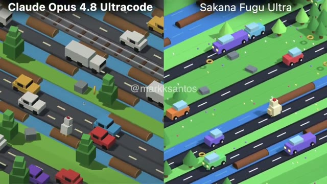</a><br /><strong>High-Quality Crossy Road Game</strong><br /><sub>Three.js · <a href="https://x.com/markksantos/status/2068962823007285628">X source</a></sub></td>
    <td valign="top"><a href="docs/prompts/cyberpunk-hovercar-racing-v1.md">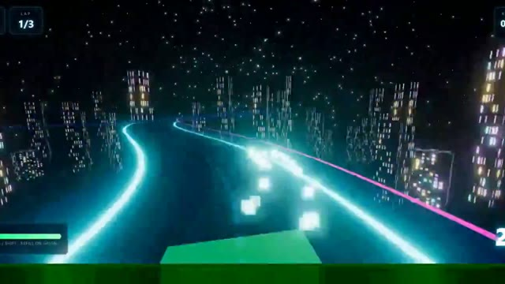</a><br /><strong>Cyberpunk Hovercar Racing</strong><br /><sub>Three.js · <a href="https://x.com/eyishazyer/status/2072677773655838950">X source</a></sub></td>
  </tr>
  <tr>
    <td valign="top"><a href="docs/prompts/eiffel-tower-paris-v1.md">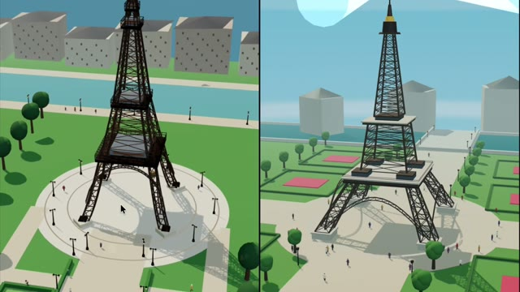</a><br /><strong>Eiffel Tower in Paris</strong><br /><sub>Three.js · <a href="https://x.com/Bhavani_00007/status/2079944268744155325">X source</a></sub></td>
    <td valign="top"><a href="docs/prompts/european-roulette-wheel-v1.md">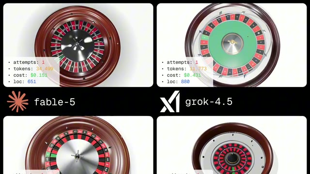</a><br /><strong>Photorealistic European Roulette</strong><br /><sub>Three.js · <a href="https://x.com/thehypedotnews/status/2077924746415518033">X source</a></sub></td>
    <td valign="top"><a href="docs/prompts/japanese-castle-v1.md"></a><br /><strong>Procedural Japanese Castle</strong><br /><sub>Three.js · <a href="https://x.com/karankendre/status/2025624483000963350">X source</a></sub></td>
  </tr>
  <tr>
    <td valign="top"><a href="docs/prompts/las-vegas-slot-machine-v1.md">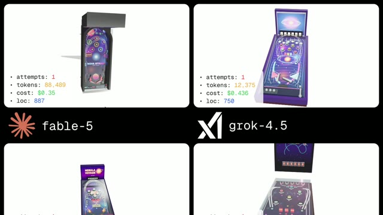</a><br /><strong>Las Vegas Slot Machine</strong><br /><sub>Three.js · <a href="https://x.com/thehypedotnews/status/2077924746415518033">X source</a></sub></td>
    <td valign="top"><a href="docs/prompts/military-armory-v1.md">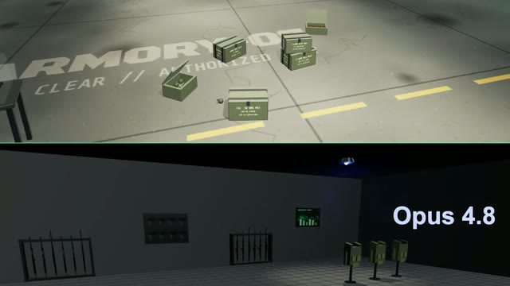</a><br /><strong>Realistic Military Armory</strong><br /><sub>Three.js · <a href="https://x.com/Bhavani_00007/status/2077798166729208223">X result</a> · <a href="https://x.com/Bhavani_00007/status/2077895351600918899">prompt</a></sub></td>
    <td valign="top"><a href="docs/prompts/offshore-rocket-landing-v1.md">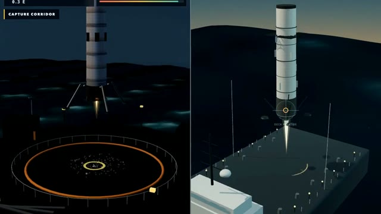</a><br /><strong>Offshore Rocket Landing</strong><br /><sub>Three.js · <a href="https://x.com/Cryptor_dot/status/2076083000777883785">X source</a></sub></td>
  </tr>
  <tr>
    <td valign="top"><a href="docs/prompts/open-world-bazooka-rpg-v1.md">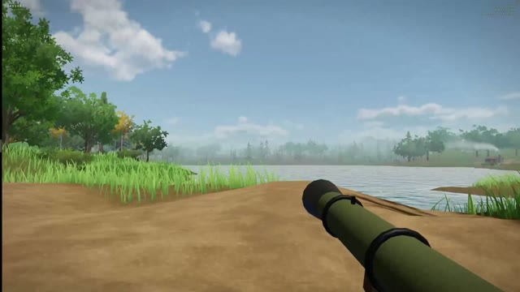</a><br /><strong>Open-World Bazooka RPG</strong><br /><sub>Three.js · <a href="https://x.com/dangreenheck/status/2064736699469459753">X source</a></sub></td>
    <td valign="top"><a href="docs/prompts/procedural-3d-world-v1.md"></a><br /><strong>Procedural Explorable 3D World</strong><br /><sub>Three.js · <a href="https://x.com/slash1sol/status/2084590501685043400">X source</a></sub></td>
    <td valign="top"><a href="docs/prompts/procedural-character-generator-v1.md">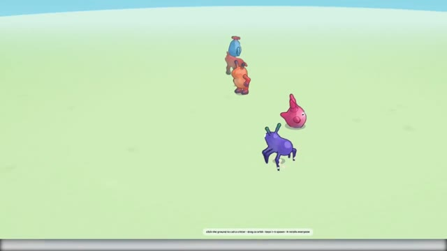</a><br /><strong>Procedural Character Generator</strong><br /><sub>Three.js · <a href="https://x.com/TimJayas/status/2073250825858892241">X source</a></sub></td>
  </tr>
  <tr>
    <td valign="top"><a href="docs/prompts/queen-annes-revenge-v1.md">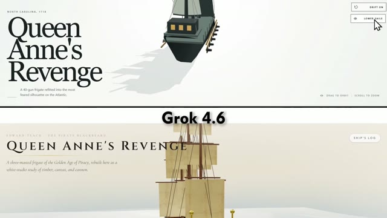</a><br /><strong>Queen Anne's Revenge</strong><br /><sub>Three.js · <a href="https://x.com/TimJayas/status/2087474534924550433">X source</a></sub></td>
    <td valign="top"><a href="docs/prompts/steam-engine-prototype-v1.md">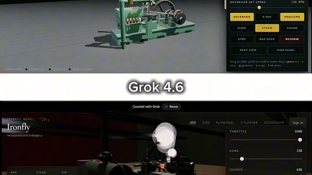</a><br /><strong>Working Steam Engine Prototype</strong><br /><sub>Three.js · <a href="https://x.com/vikktorrrre/status/2090369860672856279">X source</a></sub></td>
    <td valign="top"><a href="docs/prompts/wright-flyer-v1.md">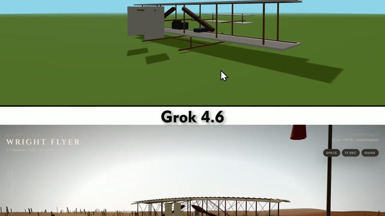</a><br /><strong>Wright Flyer</strong><br /><sub>Three.js · <a href="https://x.com/TimJayas/status/2087277264744718510">X source</a></sub></td>
  </tr>
  <tr>
    <td valign="top"><a href="docs/prompts/drowned-city-v1.md"></a><br /><strong>Infinite Neo-Gothic Drowned City</strong><br /><sub>Twigl · 2 rounds · <a href="https://x.com/emollick/status/2064424775527624736">X source</a></sub></td>
    <td valign="top"><a href="docs/prompts/lost-carcosa-v1.md"></a><br /><strong>Lost Carcosa</strong><br /><sub>Twigl · <a href="https://x.com/emollick/status/2091001394534707474">X source</a></sub></td>
    <td valign="top"><strong>Add the next case</strong><br /><br />A source-grounded Three.js or Twigl prompt can become the next benchmark case.<br /><br /><a href="CONTRIBUTING_PROMPTS.md">Contribute a prompt →</a></td>
  </tr>
</table>

<sub>Frames were extracted from public source media on 2026-09-03. Source-linked does not mean independently re-verified; open each detail page for the exact evidence status, engagement snapshot, adaptation notes, and prompt bytes.</sub>

## Quick Start / Install Skill

```bash
git clone https://github.com/PenStairs/claude-codex-visual-benchmark.git
cd claude-codex-visual-benchmark
npm install
npx playwright install chromium
npm run fetch:bgm
npm run benchmark -- doctor
```

Install the repository as an Agent Skill:

```bash
npx skills add PenStairs/claude-codex-visual-benchmark --global --all --copy
```

Then ask the agent to use `$visual-code-model-benchmark`. It will guide you through two models, method, prompt, plan review, and explicit confirmation before quota is consumed. [Read the five-minute guide](docs/quick-start.md) or [inspect the exact CLI flow](USAGE.zh-CN.md).

## Fairness and Provenance


| Controlled in an official run | Disclosed rather than hidden |
|---|---|
| Same normalized prompt bytes and round order | Codex CLI or Claude Code runner path |
| Equivalent clean scaffolds and file rules | Provider endpoint and authentication class |
| Explicit reasoning policy with no silent downgrade | Model-specific meaning of `high` or `max` |
| Parallel generation and matched capture policy | Hardware, recording fallback, repairs, retries, and failures |

- **Reasoning:** Flash profiles use `max`; all other built-in profiles use `high`.
- **Timeouts:** 60-minute soft warning, 180-minute hard limit, and 15-minute idle limit; Three.js startup allows 60 seconds.
- **Hardware:** local CPU/GPU and recording fallback belong in the run disclosure, not in a hidden global ranking.
- **Sources:** original URLs, prompt bytes, method origin, snapshots, and adaptations are recorded separately.
- **Results:** [Official](benchmarks/official/README.md) and [Community](benchmarks/community/README.md) runs answer different questions and are never silently mixed.

One run supports only this claim: under the declared prompt, profiles, runners, reasoning settings, policy, and hardware, these were the produced outputs. It does not prove that one model is universally better. Read the [fairness policy](docs/fairness.md) and [prompt provenance policy](docs/prompt-provenance.md).

## Contribute

- [Add a model profile](CONTRIBUTING_MODELS.md)
- [Add a source-grounded prompt](CONTRIBUTING_PROMPTS.md)
- [Submit a community benchmark](benchmarks/community/README.md)
- [Improve a runner or recording path](CONTRIBUTING.md)
- [Report a reproducible problem](https://github.com/PenStairs/claude-codex-visual-benchmark/issues)

Every change is checked against configuration, prompt contracts, timeout behavior, browser motion, recording quality, generated docs, and publication safety.

## Community and Project Status

[](https://github.com/PenStairs/claude-codex-visual-benchmark/releases/tag/v0.8.0)
[](docs/model-gallery.md)
[](docs/prompt-gallery.md)
[](https://github.com/PenStairs/claude-codex-visual-benchmark/actions)
[](LICENSE)

[Discussions](https://github.com/PenStairs/claude-codex-visual-benchmark/discussions) · [Roadmap](ROADMAP.md) · [Latest release](https://github.com/PenStairs/claude-codex-visual-benchmark/releases/latest) · [Changelog](CHANGELOG.md) · [Documentation](docs/README.md)

### Star History

[](https://www.star-history.com/#PenStairs/claude-codex-visual-benchmark&Date)

## Security / Disclaimer / License

Keep API keys in environment variables and treat model-generated code as untrusted. The constrained local scaffold is not a security sandbox for hostile code. Review provider terms before using subscription plans or third-party gateways. See [SECURITY.md](SECURITY.md).

This is an independent community project by [PenStairs](https://github.com/PenStairs), with no affiliation or endorsement from Anthropic, OpenAI, DeepSeek, Zhipu AI, Three.js, Twigl, or X. Product names are descriptive compatibility labels.

Code and original project documentation use the [MIT License](LICENSE). Prompt text, linked posts, and source-media frames may retain rights held by their original creators; attribution does not relicense third-party content. The optional soundtrack follows its own [license notice](assets/audio/brainiac-mixkit-license.txt).

<div align="center">

**Choose two models. Keep the prompt fixed. Let the work speak.**

[Browse benchmarks](docs/benchmark-gallery.md) · [Run your own comparison](docs/quick-start.md)

</div>
