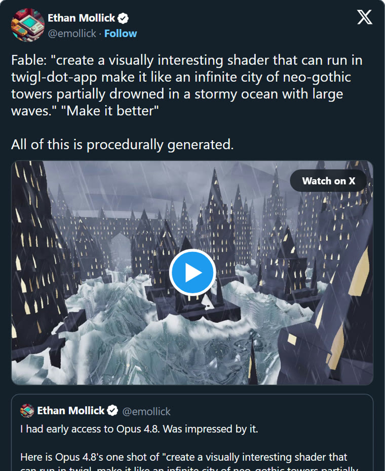
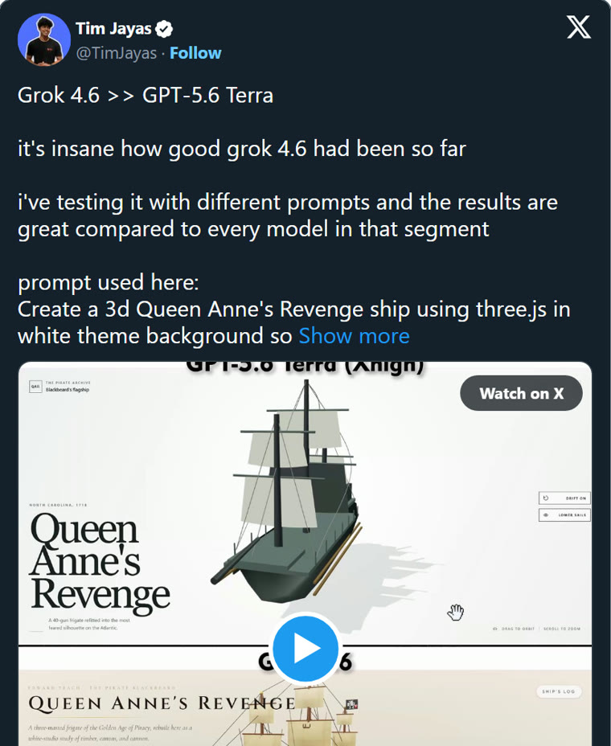
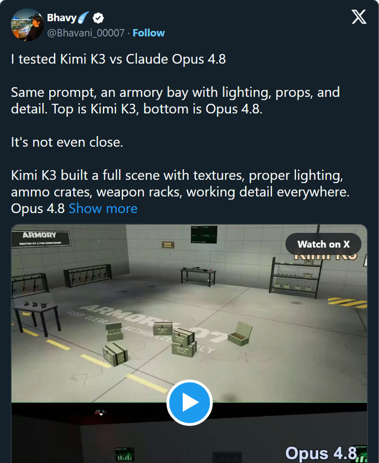
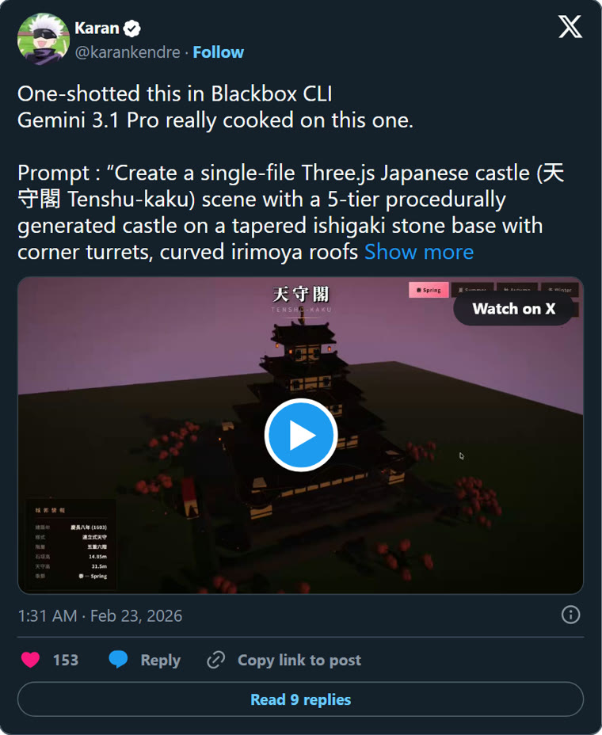

<div align="center">
  
</div>

<div align="center">

[](CHANGELOG.md)
[](docs/model-gallery.md)
[](docs/prompt-gallery.md)
[](docs/benchmark-methods.md)
[](LICENSE)

**最全、最好看、还能复现的 Claude、Codex 与自定义模型视觉测评工具。**

让两个 Coding Agent 接收完全相同的真实提示词，在彼此隔离的工作区里完成作品；系统随后验证、录屏，并输出一条上下拼接的对比视频。你看到的是模型真正做出来的东西，而不只是一行分数。

[**浏览提示词**](docs/prompt-gallery.md) · [**查看模型**](docs/model-gallery.md) · [**运行一次对比**](docs/quick-start.zh-CN.md) · [**接入你的模型**](docs/add-your-model.zh-CN.md) · [English](README.md)

</div>

## 值得拿来测模型的视觉提示词

下面四个原帖分别启发了测评库里的四条提示词。它们是经过挑选的来源案例，不是本项目运行出来的测评成绩。点击截图可以直接打开对应的 X 原帖。

<table>
  <tr>
    <td width="50%" valign="top">
      <a href="https://x.com/emollick/status/2064424775527624736"></a><br />
      <strong>无限新哥特式沉没城市</strong> · Twigl · 两轮<br />
      <sub>来源展示：<a href="https://x.com/emollick">@emollick</a></sub><br />
      <a href="docs/prompts/drowned-city-v1.md">查看原始提示词和来源 →</a>
    </td>
    <td width="50%" valign="top">
      <a href="https://x.com/TimJayas/status/2087474534924550433"></a><br />
      <strong>安妮女王复仇号</strong> · Three.js<br />
      <sub>来源展示：<a href="https://x.com/TimJayas">@TimJayas</a></sub><br />
      <a href="docs/prompts/queen-annes-revenge-v1.md">查看原始提示词和来源 →</a>
    </td>
  </tr>
  <tr>
    <td width="50%" valign="top">
      <a href="https://x.com/Bhavani_00007/status/2077798166729208223"></a><br />
      <strong>写实军械库</strong> · Three.js<br />
      <sub>来源展示：<a href="https://x.com/Bhavani_00007">@Bhavani_00007</a></sub><br />
      <a href="docs/prompts/military-armory-v1.md">查看原始提示词和来源 →</a>
    </td>
    <td width="50%" valign="top">
      <a href="https://x.com/karankendre/status/2025624483000963350"></a><br />
      <strong>程序化日本城堡</strong> · Three.js<br />
      <sub>来源展示：<a href="https://x.com/karankendre">@karankendre</a></sub><br />
      <a href="docs/prompts/japanese-castle-v1.md">查看原始提示词和来源 →</a>
    </td>
  </tr>
</table>

<sub>截图于 2026-09-03 从公开 X Embed 获取。帖子和媒体版权仍属于各自创作者。收录截图是为了说明提示词来源，不代表本项目拥有、背书或已经独立复现原帖中的结果。</sub>

## 本项目的真实测评结果

普通榜单会把模型压缩成一个数字；视觉编程任务能直接暴露构图、交互、运动、细节、运行质量和完成度。本项目把这些差异做成可回放、可查证的视频证据。


<p align="center"><sub>真实运行样例：上方 GPT‑5.6 Sol，下方 Claude Fable 5.1；两边使用同一条 Three.js 提示词和同一套录制策略。这个样例只展示作品差异，不代表任何模型在所有任务中普遍获胜。</sub></p>

## 浏览整个测评库


| 浏览入口 | 里面有什么 | 进入 |
|---|---|---|
| **Three.js 世界** | 18 条游戏、建筑、载具、模拟、程序化世界和交互提示词 | [浏览 Three.js 提示词](docs/prompt-gallery.md#threejs) |
| **Twigl Shader** | 2 条实时 GLSL 提示词，其中一条包含第二轮原文 `Make it better` | [浏览 Twigl 提示词](docs/prompt-gallery.md#twigl) |
| **模型配置** | 11 个可以直接运行的 Codex CLI 和 Claude Code 配置 | [查看完整模型清单](docs/model-gallery.md) |
| **测评结果** | 按不同证据要求分开的官方测评与社区测评 | [打开结果画廊](docs/benchmark-gallery.md) |

每个用户都可以自己定义要比较的两个模型。既可以选择内置配置，也可以[接入任意兼容模型](docs/add-your-model.zh-CN.md)；首页不会默认所有人都必须进行某一组固定的 Claude 与 Codex 对比。

## 这个项目解决什么问题

| | 能力 | 你实际得到什么 |
|---|---|---|
| 🧩 | **任意选择两个模型** | 使用内置的 11 个配置，或者接入你自己的 Codex CLI / Claude Code 兼容模型。 |
| 🎨 | **用视觉作品测模型** | 同时支持复杂 Three.js 场景和紧凑 Twigl Shader，不只比较代码文本。 |
| 🔗 | **提示词来源清楚** | 每条内置提示词保留原帖链接、实际输入文本、来源方法和已有的点赞采集快照。 |
| ⚖️ | **同条件对比** | 同一份提示词字节、等价工作区规则、干净脚手架、明确推理档位、统一录屏参数。 |
| 🎬 | **直接得到 X 专版视频** | 输出高清 H.264 竖版对比视频，两边原生尺寸上下拼接。 |
| 🧾 | **完整运行证据** | 本地保留确认哈希、耗时、Token、验证状态、录屏元数据和失败原因。 |

## 一条提示词，两个隔离 Agent，一条视觉证据


整个流程默认在本地运行。模型通过各自配置的 Agent Runner 在你的机器上写代码，生成源码、日志、报告和录屏都保存在 `runs/`；只有你明确选择发布时，最终拼接视频才会上传。账号凭据保留在 CLI 原生登录状态或环境变量中，不会写进模型 JSON。

## 五分钟开始

需要 Node.js 20.19+、FFmpeg、Playwright Chromium，以及至少一个已登录的 Runner（`codex` 或 `claude`）。

```bash
git clone https://github.com/PenStairs/claude-codex-visual-benchmark.git
cd claude-codex-visual-benchmark
npm install
npx playwright install chromium
npm run fetch:bgm
npm run benchmark -- doctor
```

先查看模型和提示词：

```bash
npm run benchmark -- list-models
npm run benchmark -- list-prompts --method threejs
npm run benchmark -- list-prompts --method twigl
```

正式消耗模型额度前，先生成可核对的运行计划：

```bash
npm run benchmark -- describe --model-a gpt-5.6-sol --model-b claude-fable-5-1 --method threejs --prompt military-armory-v1
```

确认模型、Runner、推理强度、提示词原文和执行方式后，把返回的哈希带入正式命令：

```bash
npm run benchmark -- run --model-a gpt-5.6-sol --model-b claude-fable-5-1 --method threejs --prompt military-armory-v1 --confirmed-plan <sha256>
```

首次付费运行前请阅读完整的[中文快速开始](docs/quick-start.zh-CN.md)。

### 作为 Codex Skill 安装

仓库根目录本身就是一个完整 Skill：

```bash
npx skills add PenStairs/claude-codex-visual-benchmark --global --all --copy
```

也可以把仓库复制到 Agent 的 Skills 目录，然后让 Agent 使用 `$visual-code-model-benchmark`。Skill 会依次引导你选择两个模型、测评方式、提示词，展示运行计划，并在你明确确认后才开始消耗额度。

## 模型配置与 Runner

“模型配置”不只是模型名，还包括 Runner、端点、鉴权方式和推理强度。因此同一个底层模型可以分别拥有 Codex CLI 和 Claude Code 两份配置，这不是重复数据。

| Runner | 内置配置数 | 适合的接入方式 |
|---|---:|---|
| Codex CLI | 6 | OpenAI 原生登录、Responses 兼容端点 |
| Claude Code | 5 | Anthropic 原生登录、Anthropic 兼容端点 |

Flash 模型默认使用各自配置里的最高推理档；其他模型默认 `high`。系统禁止自动降档，避免一次“高质量测评”在不知情时被改成低推理模式。

查看自动生成的[完整模型清单](docs/model-gallery.md)，或复制下面的模板：

- [OpenAI Responses 兼容模型](examples/custom-models/openai-responses-compatible.json)
- [Anthropic 兼容模型](examples/custom-models/anthropic-compatible.json)

## 提示词效果、原帖和来源都写清楚

当前内置库包括：

- **18 条 Three.js 提示词**：游戏、模拟、建筑、载具、程序化世界和交互场景。
- **2 条 Twigl 提示词**：实时 Shader，其中一条保留两轮对话，第二轮原文就是 `Make it better`。
- **20 条已关联来源的提示词**，每条都带直接 X 帖子 URL，并在已有清单中保留点赞数和采集日期。

[浏览全部提示词 →](docs/prompt-gallery.md)

每个详情页都会展示实际发给模型的原始提示词、全部来源 URL、来源账号和帖子 ID、测评方式、轮次顺序、指标采集日期，以及任何公平性改写或疑似原文错误。


这里会刻意区分：**“已经关联原帖”不等于“本次重新独立核验完整来源”**。点赞数也只按历史采集快照展示，不冒充当前实时数据。详情见[提示词溯源说明](docs/prompt-provenance.md)。

## 官方测评和社区测评分开

每个用户都可以自定义模型，所以本项目不会把所有配置粗暴混进一个“宇宙总榜”。

- **官方测评**：使用发布版本中的模型配置、提示词版本、Runner、强制推理策略、干净工作区和完整证据。
- **社区测评**：使用自定义模型、端点、提示词、Runner 补丁、录制策略或硬件；有价值，但必须单独披露配置。

两者都欢迎，只是回答的问题不同。详见[官方与社区测评](docs/official-vs-community.md)和[公平性规则](docs/fairness.md)。

## 目录结构

```text
config/models/          模型配置
config/prompts/         带来源的 Three.js / Twigl 提示词
config/methods/         测评脚手架与文件契约
assets/templates/       两个模型拿到的隔离工作区
scripts/                调度、验证、录屏与测试
schemas/                自定义扩展的 JSON Schema
examples/               可复制的自定义模型与提示词样例
docs/                   使用文档和自动生成画廊
benchmarks/             官方/社区结果发布规范
runs/                   本地结果，始终不进入 Git
```

## 参与贡献

你可以贡献新模型、新提示词、Runner 改进、可复现 Bug 或社区测评结果。请先阅读 [CONTRIBUTING.md](CONTRIBUTING.md)，再看专门的[模型贡献说明](CONTRIBUTING_MODELS.md)或[提示词贡献说明](CONTRIBUTING_PROMPTS.md)。

## 安全、隐私与独立性

- API Key 只放环境变量，永远不要提交。
- 所有模型工作区和证据默认只在 `runs/` 本地保存。
- 模型生成的代码属于不可信代码；本项目会限制脚手架和网络访问，但不是面向恶意代码的强安全沙箱。
- 使用订阅套餐或第三方网关前，请自行确认服务条款。

完整说明见 [SECURITY.md](SECURITY.md)。这是 [PenStairs](https://github.com/PenStairs) 发起的独立社区项目，与 Anthropic、OpenAI、DeepSeek、智谱 AI、Three.js、Twigl、X 不存在隶属、赞助或官方背书关系。

## 开源协议

代码和本项目原创文档采用 [MIT License](LICENSE)。提示词原文和外部帖子可能仍归原作者所有；保留来源链接不等于重新授权第三方内容。可选背景音乐会单独下载，并遵循自己的[许可说明](assets/audio/brainiac-mixkit-license.txt)。
